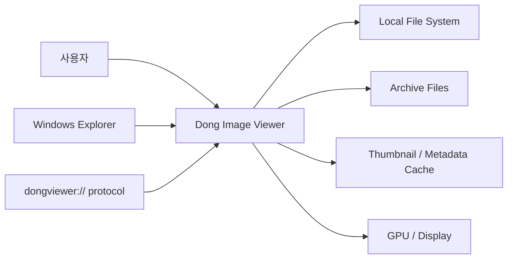
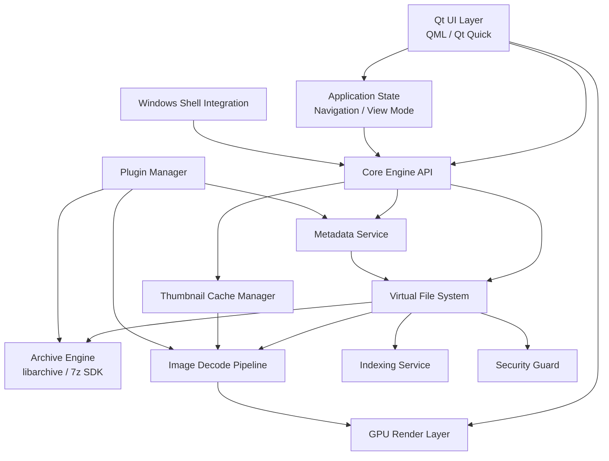
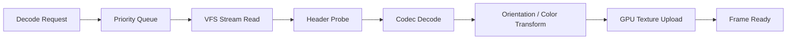
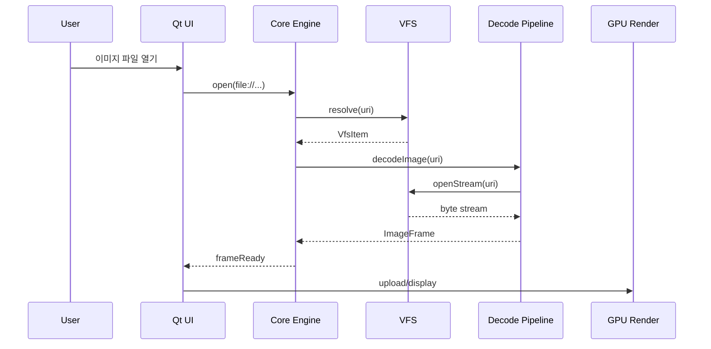
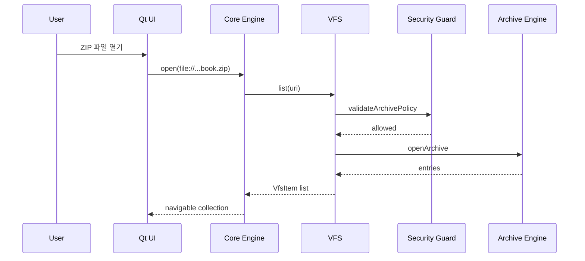
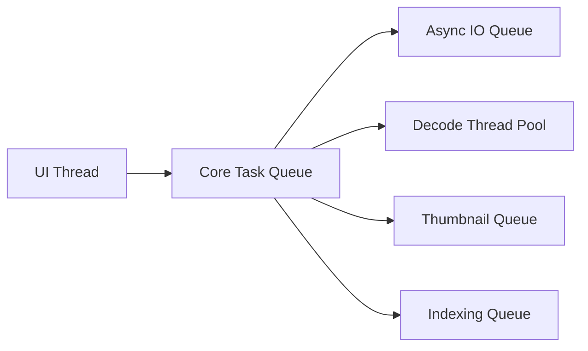

# Dong Image Viewer 설계 문서

본 문서는 `docs/requirements.md`와 `docs/quality-attributes.md`를 기반으로 작성한 상위 수준 설계 문서이다. 목표는 Windows 데스크톱 환경에서 이미지 파일과 압축 파일 내부 이미지를 빠르고 안전하게 탐색하는 애플리케이션 구조를 정의하는 것이다.

## 1. 설계 목표

Dong Image Viewer는 고성능 이미지 뷰어와 아카이브 브라우저의 성격을 동시에 가진다. 사용자는 로컬 폴더, 이미지 파일, 압축 파일, 중첩 압축 파일을 동일한 탐색 모델로 다룰 수 있어야 한다.

핵심 설계 목표는 다음과 같다.

- 로컬 파일과 아카이브 내부 파일을 하나의 VFS로 통합한다.
- 일반 이미지 표시 지연을 사용자 인지 기준 100ms 이하로 낮춘다.
- 500MB 이하 ZIP 파일은 200ms 이내에 탐색 가능한 상태로 만든다.
- 이미지 탐색, 확대, 이동, 회전은 60 FPS 이상을 목표로 한다.
- 외부 입력 파일에 대해 Zip bomb, 경로 탐색, 손상 파일을 방어적으로 처리한다.
- Qt UI와 C++20 Core Engine을 분리해 유지보수성과 확장성을 확보한다.

## 2. 품질속성 기반 설계 방침

| 품질속성 | 설계 방침 |
|---|---|
| 성능 | 비동기 IO, 디코딩 파이프라인, 프리패치, GPU 렌더링, 메모리/디스크 캐시 사용 |
| 사용성 | 로컬 파일과 아카이브를 동일한 탐색 경험으로 제공, 키보드/마우스 중심 조작 지원 |
| 보안 | 아카이브 파싱 전 리소스 제한 적용, 경로 정규화, 압축률 제한, 손상 파일 격리 |
| 신뢰성 | 디코딩 실패, 캐시 손상, 아카이브 일부 손상을 개별 오류로 처리하고 전체 앱은 유지 |
| 자원 효율성 | LRU 메모리 캐시, 디스크 캐시, 백그라운드 작업 우선순위 제어 |
| 확장성 | 이미지 코덱, 아카이브 포맷, 메타데이터 파서를 플러그인으로 확장 |
| 유지보수성 | UI, VFS, Archive, Decode, Thumbnail, Shell Integration 모듈 분리 |
| 배포성 | 설치형과 포터블 모드를 모두 지원하며 Windows 통합 기능은 선택적으로 활성화 |
| 상호운용성 | 파일 연결, 컨텍스트 메뉴, COM 셸 확장, 프로토콜 핸들러 지원 |

## 3. 시스템 컨텍스트



애플리케이션의 주요 진입점은 앱 직접 실행, 파일 연결, Explorer 컨텍스트 메뉴, 프로토콜 핸들러이다. 모든 진입점은 내부적으로 동일한 열기 요청으로 정규화한 뒤 VFS 계층으로 전달한다.

## 4. 상위 아키텍처



## 5. 모듈 설계

### 5.1 Qt UI Layer

역할:

- 이미지 뷰어 화면, 인덱스 사이드바, 썸네일 목록, 전체화면 오버레이를 제공한다.
- 키보드, 마우스, 드래그 앤 드롭 입력을 Application State로 전달한다.
- Core Engine의 비동기 결과를 받아 화면 상태를 갱신한다.

설계 결정:

- 기본 UI는 Qt 6.6+와 Qt Quick(QML)을 우선 사용한다.
- 렌더링은 Qt SceneGraph 기반으로 구성하고, 백엔드는 플랫폼 상태에 따라 OpenGL 또는 Vulkan을 사용한다.
- UI 스레드는 파일 IO, 아카이브 파싱, 이미지 디코딩을 직접 수행하지 않는다.

### 5.2 Application State

역할:

- 현재 열려 있는 위치, 선택 이미지, 정렬 기준, 뷰 모드, 확대/회전 상태를 관리한다.
- 이전/다음 이미지 탐색 요청을 VFS 항목 기준으로 변환한다.
- 프리패치 대상과 썸네일 요청 우선순위를 결정한다.

주요 상태:

- `currentUri`: 현재 이미지 또는 폴더 URI
- `currentCollection`: 현재 탐색 중인 VFS 목록
- `sortMode`: 이름, 날짜, 크기, 타입
- `viewMode`: 일반, 전체화면, 슬라이드쇼, 듀얼 패널
- `transform`: zoom, pan, rotation

### 5.3 Core Engine API

역할:

- UI와 C++ Core Engine 사이의 안정적인 경계를 제공한다.
- 파일 열기, 목록 조회, 이미지 요청, 썸네일 요청, 메타데이터 조회를 비동기 API로 노출한다.
- Core 내부 오류를 UI가 처리 가능한 오류 모델로 변환한다.

대표 API:

```cpp
class ViewerCore {
public:
    Task<OpenResult> open(Uri uri);
    Task<ItemList> list(Uri uri, SortMode sortMode);
    Task<ImageFrame> decodeImage(Uri uri, DecodeOptions options);
    Task<Thumbnail> requestThumbnail(Uri uri, ThumbnailOptions options);
    Task<Metadata> readMetadata(Uri uri);
    void cancel(RequestId requestId);
};
```

### 5.4 Virtual File System

역할:

- 로컬 파일시스템과 아카이브 내부 파일을 동일한 탐색 모델로 표현한다.
- `file://`과 `archive://` URI를 해석한다.
- 중첩 아카이브 경로를 투명하게 탐색한다.
- 파일명, 크기, 수정일, 타입, 압축 정보 등 메타데이터를 추상화한다.

URI 예시:

```text
file:///D:/Images/sample.jpg
file:///D:/Comics/book.zip
archive://file:///D:/Comics/book.zip!/chapter01/001.webp
archive://file:///D:/Comics/book.zip!/nested.cbz!/001.jpg
```

대표 모델:

```cpp
struct VfsItem {
    Uri uri;
    std::string displayName;
    ItemType type;
    uint64_t compressedSize;
    uint64_t uncompressedSize;
    Timestamp modifiedAt;
    bool isArchive;
    bool isImage;
};
```

설계 결정:

- VFS는 UI 상태를 알지 않는다.
- VFS는 Archive Engine과 Local File Provider를 조합해 항목을 제공한다.
- 모든 경로는 정규화 후 Security Guard를 통과해야 한다.

### 5.5 Archive Engine

역할:

- ZIP, RAR, 7Z, TAR, GZ, ISO를 열고 항목 목록과 스트림을 제공한다.
- libarchive를 기본 엔진으로 사용하고, RAR/7Z 호환성 이슈는 7-Zip SDK 어댑터로 보완한다.
- 중첩 아카이브는 VFS가 Archive Engine을 재귀적으로 호출해 처리한다.

보안 설계:

- 압축률 제한을 적용한다.
- 최대 파일 수, 최대 아카이브 크기, 최대 중첩 깊이를 제한한다.
- `../`, 절대 경로, 드라이브 루트 접근 경로는 정규화 단계에서 차단한다.
- 손상된 엔트리는 개별 오류로 기록하고 나머지 항목 탐색은 계속 허용한다.

### 5.6 Image Decode Pipeline

역할:

- PNG, JPEG, WEBP, BMP, GIF, TIFF, AVIF 이미지 디코딩을 담당한다.
- EXIF orientation을 반영한 디코딩 결과를 제공한다.
- 큰 이미지는 progressive decoding 또는 축소 디코딩을 우선 사용한다.

파이프라인:



우선순위:

- 현재 표시 이미지
- 다음/이전 프리패치 이미지
- 현재 화면에 보이는 썸네일
- 화면 밖 썸네일
- 백그라운드 인덱싱

### 5.7 Thumbnail Cache Manager

역할:

- 썸네일을 비동기로 생성하고 메모리/디스크 캐시에 저장한다.
- 화면에 필요한 썸네일을 우선 생성한다.
- 원본 파일 변경, 캐시 버전 변경, 손상 캐시를 감지해 재생성한다.

캐시 키:

```text
hash(uri + sourceLastModified + sourceSize + thumbnailProfile + decoderVersion)
```

캐시 계층:

- Memory LRU Cache: 최근 사용 썸네일과 현재 화면 주변 썸네일 보관
- Disk Cache: 앱 재시작 후에도 재사용 가능한 썸네일 보관
- Rebuild Mode: 캐시 인덱스 손상 시 디스크 캐시를 무시하거나 재구성

### 5.8 Metadata Service

역할:

- EXIF orientation, 카메라 정보, 촬영 시각을 추출한다.
- VFS 메타데이터와 이미지 메타데이터를 통합한다.
- 정렬과 필터링에 필요한 값을 제공한다.

확장:

- 메타데이터 provider 플러그인을 통해 추가 포맷 또는 태그/평점 기능을 확장할 수 있다.

### 5.9 Indexing Service

역할:

- 폴더와 아카이브 목록을 백그라운드에서 스캔한다.
- 대용량 컬렉션에서 탐색 목록, 썸네일, 메타데이터 준비 시간을 줄인다.
- 사용자 조작 중에는 낮은 우선순위로 동작한다.

설계 결정:

- Indexing Service는 UI 응답성을 침해하지 않도록 취소 가능한 작업으로 구성한다.
- 파일 변경 감지는 로컬 파일시스템에서는 OS 이벤트를 활용하고, 아카이브 내부는 아카이브 파일의 변경 시각과 크기로 무효화한다.

### 5.10 Plugin Manager

역할:

- `.dll` 기반 플러그인을 검색, 로딩, 검증한다.
- 플러그인 API 버전을 확인한다.
- 이미지 코덱, 아카이브 포맷, 메타데이터 provider를 등록한다.

설계 결정:

- 플러그인 로딩 실패는 앱 실행 실패로 이어지지 않는다.
- 플러그인별 기능은 Core Engine Registry에 등록한다.
- 플러그인 API는 버전 필드와 capability 선언을 포함한다.

### 5.11 Windows Shell Integration

역할:

- 파일 연결, Explorer 컨텍스트 메뉴, 썸네일 provider, preview handler, 프로토콜 핸들러를 제공한다.
- 설치형 모드에서 레지스트리 등록을 수행한다.
- 포터블 모드에서는 레지스트리 의존 기능을 비활성화하거나 사용자 선택으로 제한한다.

설계 결정:

- Shell Extension은 앱 본체와 분리된 COM 모듈로 구성한다.
- Explorer 프로세스 안정성을 위해 Shell Extension에서는 무거운 디코딩을 직접 수행하지 않고 제한된 썸네일 요청만 처리한다.
- 앱 본체 실행 인자는 Core Engine의 `open(Uri)` 요청으로 정규화한다.

## 6. 주요 런타임 시나리오

### 6.1 로컬 이미지 열기



### 6.2 아카이브 탐색



### 6.3 다음 이미지 탐색

1. UI가 다음 이미지 요청을 Application State에 전달한다.
2. Application State는 현재 정렬 기준에서 다음 `VfsItem`을 선택한다.
3. Core Engine은 현재 이미지 디코딩을 최우선 작업으로 큐에 넣는다.
4. 동시에 다음/이전 주변 이미지는 프리패치 작업으로 등록한다.
5. 디코딩 결과가 도착하면 UI는 GPU 텍스처를 갱신한다.
6. 실패한 이미지는 오류 상태로 표시하고 탐색 흐름은 유지한다.

### 6.4 썸네일 생성

1. UI가 현재 보이는 목록 범위의 썸네일을 요청한다.
2. Thumbnail Cache Manager가 Memory Cache를 조회한다.
3. 없으면 Disk Cache를 조회한다.
4. 없거나 무효화된 경우 Decode Pipeline에 낮은 해상도 디코딩을 요청한다.
5. 생성된 썸네일은 메모리 캐시와 디스크 캐시에 저장한다.
6. UI는 완료 이벤트를 받아 해당 항목만 갱신한다.

## 7. 동시성 설계

작업은 UI 스레드, Core 작업 스레드, IO 작업, 디코딩 작업, 인덱싱 작업으로 분리한다.



설계 원칙:

- UI 스레드에서는 긴 작업을 수행하지 않는다.
- 현재 표시 이미지 요청은 항상 썸네일/인덱싱보다 높은 우선순위를 가진다.
- 모든 백그라운드 작업은 취소 가능해야 한다.
- 큐는 요청 우선순위와 최신성에 따라 오래된 작업을 폐기할 수 있어야 한다.
- 메모리 압박이 감지되면 프리패치와 썸네일 작업을 줄인다.

## 8. 데이터 및 캐시 설계

### 8.1 설정 데이터

저장 항목:

- 단축키 설정
- 뷰 모드 기본값
- 캐시 크기 제한
- 최근 열기 목록
- 플러그인 활성화 상태
- 포터블 모드 여부

포터블 모드에서는 실행 파일 주변의 설정 디렉터리를 사용하고, 설치형 모드에서는 사용자 AppData 하위 디렉터리를 사용한다.

### 8.2 캐시 데이터

캐시 종류:

- 썸네일 이미지
- 메타데이터 인덱스
- 아카이브 엔트리 목록 인덱스
- 최근 디코딩 이미지 메모리 캐시

무효화 기준:

- 원본 파일 크기 변경
- 원본 파일 수정 시각 변경
- 디코더 버전 변경
- 썸네일 프로필 변경
- 캐시 스키마 버전 변경

## 9. 오류 처리 설계

오류는 사용자에게 필요한 수준으로 축약해서 표시하되, 내부 로그에는 원인을 보존한다.

| 오류 유형 | 처리 방식 |
|---|---|
| 손상 이미지 | 해당 항목에 오류 표시, 다음/이전 탐색 허용 |
| 손상 아카이브 | 읽을 수 있는 항목만 표시하거나 열기 실패 메시지 표시 |
| Zip bomb 의심 | 보안 정책 위반으로 열기 중단 |
| 경로 탐색 시도 | 해당 엔트리 제외 및 보안 로그 기록 |
| 캐시 손상 | 캐시 재빌드 또는 캐시 삭제 후 재생성 |
| 플러그인 로딩 실패 | 플러그인 비활성화 및 앱 실행 지속 |
| Shell 등록 실패 | 핵심 앱 기능은 유지하고 설정 화면에서 상태 표시 |

## 10. 보안 설계

### 10.1 입력 검증

- 모든 외부 경로는 URI로 변환한 뒤 정규화한다.
- 아카이브 엔트리 경로는 상대 경로만 허용한다.
- `../`, 절대 경로, 드라이브 경로, UNC 우회 경로를 차단한다.
- 프로토콜 핸들러 입력은 허용된 URI 스키마와 경로 형식만 통과시킨다.

### 10.2 리소스 제한

기본 정책:

- 최대 아카이브 크기 제한
- 최대 엔트리 수 제한
- 최대 중첩 아카이브 깊이 제한
- 최대 압축 해제 예상 크기 제한
- 비정상 압축률 제한
- 디코딩 이미지 최대 픽셀 수 제한

### 10.3 격리

- 아카이브 파싱과 이미지 디코딩은 실패 가능성이 높은 작업으로 보고 개별 작업 단위에서 격리한다.
- Shell Extension은 앱 본체보다 더 제한된 기능만 수행한다.
- 향후 플러그인 샌드박스는 고위험 플러그인에 대해 별도 프로세스 모델로 확장할 수 있다.

## 11. 배포 설계

### 11.1 설치형 모드

도구:

- Qt Installer Framework

설치 책임:

- 실행 파일과 런타임 배포
- 파일 연결 등록
- Explorer 컨텍스트 메뉴 등록
- 선택적 COM Shell Extension 등록
- 프로토콜 핸들러 등록
- 제거 시 등록 항목 정리

### 11.2 포터블 모드

특징:

- 레지스트리 의존 없이 실행 가능
- 설정과 캐시를 앱 디렉터리 또는 지정된 portable data 디렉터리에 저장
- Shell Integration은 기본 비활성화
- 파일 연결은 사용자가 명시적으로 요청한 경우에만 제공

## 12. 기술 스택

| 영역 | 선택 |
|---|---|
| UI Framework | Qt 6.6+ |
| UI 구현 | Qt Quick(QML) 우선, 필요 시 Qt Widgets 보조 |
| Core Language | C++20 |
| Rendering | Qt SceneGraph, OpenGL/Vulkan backend |
| Archive | libarchive, 7-Zip SDK |
| Image Decode | libjpeg-turbo, libpng, libwebp, libavif, optional libtiff |
| Concurrency | Qt ThreadPool 또는 custom C++ thread pool |
| Build | CMake |
| Dependency | vcpkg 또는 Conan |
| Installer | Qt Installer Framework, optional Inno Setup |
| Windows Integration | Win32 API, COM, Registry |

## 13. 설계상 주요 결정

### 13.1 Qt Quick 우선 사용

성능과 부드러운 UI 전환, 전체화면 오버레이, 썸네일 목록 렌더링을 고려해 Qt Quick을 기본 UI 방식으로 둔다. 단, Windows 셸 통합이나 설정성 화면처럼 위젯 기반 구현이 더 단순한 영역은 Qt Widgets 보조 사용을 허용한다.

### 13.2 VFS를 중심 아키텍처로 사용

로컬 파일과 아카이브 내부 파일의 탐색 경험을 통합하기 위해 모든 파일 접근은 VFS를 거친다. UI와 디코더는 실제 데이터가 로컬 파일인지 아카이브 엔트리인지 직접 알 필요가 없다.

### 13.3 비동기 파이프라인 우선

성능과 사용성을 동시에 만족하기 위해 IO, 아카이브 파싱, 디코딩, 썸네일 생성, 인덱싱은 비동기로 처리한다. 현재 화면에 필요한 작업만 높은 우선순위를 갖고, 나머지는 취소 가능하게 둔다.

### 13.4 방어적 파일 파싱

지원 대상 파일이 모두 외부 입력이므로 아카이브 파싱과 이미지 디코딩은 신뢰하지 않는다. 리소스 제한, 경로 정규화, 손상 파일 격리, 오류 복구 흐름을 초기 설계부터 포함한다.

## 14. 추적성 매트릭스

| 요구사항 | 설계 요소 | 관련 품질속성 |
|---|---|---|
| 압축 해제 없이 아카이브 탐색 | VFS, Archive Engine, Security Guard | 성능, 보안, 사용성 |
| 중첩 아카이브 지원 | VFS URI, Archive Engine 재귀 처리 | 확장성, 신뢰성 |
| GPU 가속 렌더링 | Qt SceneGraph, GPU Render Layer | 성능, 사용성 |
| 썸네일 캐싱 | Thumbnail Cache Manager | 성능, 자원 효율성 |
| 다음/이전 프리패치 | Application State, Decode Queue | 성능, 사용성 |
| EXIF 메타데이터 | Metadata Service | 사용성, 확장성 |
| 파일 연결과 컨텍스트 메뉴 | Windows Shell Integration | 상호운용성, 배포성 |
| Zip bomb 방어 | Security Guard, Archive Policy | 보안, 신뢰성 |
| 캐시 재빌드 | Cache Manager | 신뢰성 |
| 플러그인 구조 | Plugin Manager, Registry | 확장성, 유지보수성 |
| 설치형/포터블 모드 | Installer, Configuration Store | 배포성 |

## 15. MVP 설계 범위

초기 구현은 핵심 품질속성을 검증할 수 있는 범위로 제한한다.

MVP 포함:

- Qt Quick 기반 기본 이미지 뷰어
- 로컬 폴더 탐색
- ZIP 아카이브 탐색
- VFS 기본 구조
- JPEG, PNG, WEBP 디코딩
- 다음/이전 탐색
- 썸네일 메모리 캐시
- 기본 디스크 썸네일 캐시
- 경로 정규화와 Zip bomb 기본 방어
- CMake 빌드

MVP 제외 또는 후순위:

- RAR/7Z 고급 호환성
- COM 기반 Shell Extension
- Explorer Preview Handler
- 플러그인 샌드박스
- AI tagging, OCR, Cloud sync
- 듀얼 패널 모드

## 16. 미해결 설계 이슈

- Qt Quick 단독 구성으로 모든 설정 화면을 구현할지, 일부 Qt Widgets를 혼용할지 결정이 필요하다.
- RAR 지원을 어느 수준까지 기본 제공할지 라이선스와 배포 정책 검토가 필요하다.
- 플러그인 샌드박스를 초기 버전에 포함할지, 향후 별도 프로세스 모델로 둘지 결정이 필요하다.
- 디스크 캐시 위치와 최대 크기 기본값을 Windows 설치형/포터블 모드별로 확정해야 한다.
- AVIF, TIFF, GIF animation을 MVP에 포함할지 후속 릴리스로 미룰지 결정이 필요하다.

## 17. 결론

Dong Image Viewer의 설계 중심은 VFS, 비동기 디코딩 파이프라인, 방어적 아카이브 처리, GPU 렌더링이다. 이 네 가지가 요구사항의 핵심인 빠른 이미지 표시, 압축 파일 내부 탐색, 낮은 지연 시간, 안전한 외부 파일 처리를 직접적으로 뒷받침한다.

초기 구현에서는 VFS와 ZIP 탐색, 기본 이미지 디코딩, 썸네일 캐시, 보안 정책을 먼저 구현해 성능과 안정성 기준을 검증하는 것이 가장 적절하다. 이후 플러그인, Shell Extension, 고급 포맷 지원, 포터블/설치형 배포 기능을 단계적으로 확장한다.
